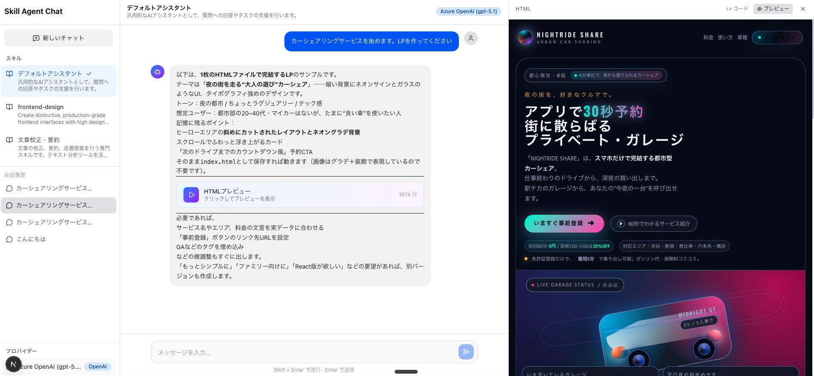

# Skill Agent Chat



スキル機能を備えたLLMエージェントチャットアプリです。OpenAI / Azure OpenAI / Azure Anthropic に対応し、スキル（AIの役割定義）を切り替えながら会話できます。会話履歴はローカルのSQLiteに自動保存され、ページをリロードしても復元できます。

## 主な機能

- **マルチスキル対応** — スキル（Markdownファイル）でAIの振る舞いを定義し、サイドバーから切り替え可能
- **会話履歴の永続化** — SQLite + Drizzle ORMで会話をDBに保存。過去の会話をクリックで復元
- **ツール呼び出し** — テキスト分析、Web検索（デモ）、日時取得などのツールをAIが自動で使用
- **HTMLプレビュー** — AIが生成したHTMLコードブロックをiframeでライブプレビュー表示
- **ストリーミング応答** — AIの応答をリアルタイムにストリーム表示
- **レスポンシブUI** — PC・モバイル対応のチャットインターフェース（ダークモード対応）
- **LLMプロバイダー切替** — 環境変数でOpenAI、Azure OpenAI、Azure Anthropic（Claude）を切り替え

## セットアップ

### 必要要件

- Node.js 20以上
- npm
- OpenAI、Azure OpenAI、Azure Anthropic いずれかのAPIキー

### インストール

```bash
git clone <repository-url>
cd skill-agent-chat
npm install
```

### 環境変数の設定

`.env.example` をコピーして `.env.local` を作成し、利用するプロバイダーの情報を設定します。

```bash
cp .env.example .env.local
```

#### OpenAI を使う場合

```env
LLM_PROVIDER=openai

OPENAI_API_KEY=sk-your-api-key
OPENAI_MODEL=gpt-4o
```

#### Azure OpenAI を使う場合

```env
LLM_PROVIDER=azure-openai

AZURE_OPENAI_ENDPOINT=https://your-resource.openai.azure.com
AZURE_OPENAI_API_KEY=your-api-key
AZURE_OPENAI_DEPLOYMENT_NAME=gpt-5.1
```

#### Azure Anthropic (Claude) を使う場合

```env
LLM_PROVIDER=azure-anthropic

AZURE_ANTHROPIC_RESOURCE=your-resource
AZURE_ANTHROPIC_API_KEY=your-api-key
AZURE_ANTHROPIC_MODEL=claude-sonnet-4-5
```

### 起動

```bash
npm run dev
```

ブラウザで [http://localhost:3000](http://localhost:3000) を開きます。

データベース（`data/chat.db`）は初回起動時に自動作成されます。手動でのマイグレーション操作は不要です。

## 使い方

### 基本的なチャット

1. サイドバーからスキルを選択します（デフォルトは「デフォルトアシスタント」）
2. 画面下部のテキストボックスにメッセージを入力し、Enterキーまたは送信ボタンで送信します
3. AIがストリーミングでリアルタイムに応答します
4. **Shift + Enter** で改行を入力できます

### スキルの切り替え

サイドバーのスキル一覧から使いたいスキルをクリックすると、AIの振る舞い（システムプロンプト）が切り替わります。現在選択中のスキルにはチェックマークが表示されます。

プリセットスキル:

#### デフォルトアシスタント
汎用的なAIアシスタントです。質問応答やタスク支援に加え、テキスト分析・Web検索（デモ）・日時取得のツールを自動で活用します。特定のスキルを選ばない場合はこちらが使われます。

#### frontend-design
プロダクション品質のフロントエンドUI（HTML/CSS/JS、React等）を生成する専門スキルです。「ありがちなAIデザイン」を避け、タイポグラフィ・配色・モーション・空間構成にこだわった独創的なインターフェースを設計します。LPやコンポーネントの作成を依頼すると、HTMLコードを生成し、サイドパネルでライブプレビューを確認できます。

#### 文章校正・要約
日本語テキストの校正・要約・改善提案を行う専門スキルです。テキストを貼り付けると、まず `analyzeText` ツールで文字数・段落数などを自動計測し、その上で誤字脱字の修正、簡潔な要約、読みやすさの改善案を提示します。

### 会話履歴

- メッセージ送信時に会話が自動保存されます
- サイドバーの「会話履歴」セクションに過去の会話が一覧表示されます
- 会話をクリックすると、メッセージが復元されます
- 会話にマウスをホバーするとゴミ箱アイコンが表示され、クリックで削除できます
- 「新しいチャット」ボタンで新規の会話を開始できます
- ページをリロードしても会話履歴は保持されます

### コードブロック & HTMLプレビュー

AIが返したコードブロックはチャット内にカード形式で表示されます。カードをクリックすると**右サイドパネル**が開き、コード全体を確認できます。

HTMLコードブロック（` ```html `）の場合は再生ボタン付きのカードが表示され、サイドパネルで**ライブプレビュー**を確認できます。

- **プレビュータブ** — sandboxed iframeでHTMLをレンダリング
- **コードタブ** — ソースコードを表示
- パネル右上の **x** ボタンで閉じる

### ツール呼び出し

AIはスキルの設定に応じて、以下のツールを自動的に使用します:

| ツール | 内容 |
|--------|------|
| テキスト分析 | 文字数、段落数、文数などを計測 |
| Web検索 | Web検索を実行（デモデータ） |
| 日時取得 | 現在の日時を取得（Asia/Tokyo） |

ツールの実行結果はチャット上に折りたたみ表示されます。

## スキルのカスタマイズ

### スキルの追加

`skills/` ディレクトリにMarkdownファイルを追加することで、独自のスキルを作成できます。

#### ディレクトリ方式（推奨）

```
skills/
└── my-new-skill/
    └── SKILL.md
```

#### ファイル方式

```
skills/
└── my-new-skill.md
```

### スキルファイルの書式

YAMLフロントマターでメタ情報を定義し、本文にシステムプロンプトを記述します。

```markdown
---
name: スキル表示名
description: サイドバーに表示される短い説明文
---

ここにAIへの指示（システムプロンプト）を記述します。

## 応答方針
- 箇条書きでルールを定義できます
- Markdown形式で自由に記述できます
```

ファイルを保存してページをリロードすると、サイドバーに新しいスキルが表示されます。

## プロジェクト構成

```
skill-agent-chat/
├── skills/                          # スキル定義ファイル
│   ├── default.md                   #   デフォルトアシスタント
│   ├── frontend-design/SKILL.md     #   フロントエンドデザイン
│   └── text-proofreading/SKILL.md   #   文章校正・要約
├── src/
│   ├── app/
│   │   ├── api/
│   │   │   ├── chat/route.ts        # チャットAPI（ストリーミング）
│   │   │   ├── skills/route.ts      # スキル一覧API
│   │   │   └── conversations/       # 会話CRUD API
│   │   ├── layout.tsx               # ルートレイアウト
│   │   ├── page.tsx                 # メインページ
│   │   └── globals.css              # グローバルCSS
│   ├── components/
│   │   ├── chat/                    # チャット関連コンポーネント
│   │   │   ├── chat-area.tsx        #   チャットエリア
│   │   │   ├── chat-input.tsx       #   入力フォーム
│   │   │   ├── message-bubble.tsx   #   メッセージ吹き出し
│   │   │   ├── html-preview.tsx     #   HTMLプレビュー
│   │   │   └── tool-call-display.tsx#   ツール実行表示
│   │   ├── sidebar/                 # サイドバー関連
│   │   │   ├── sidebar.tsx          #   サイドバー本体
│   │   │   ├── skill-selector.tsx   #   スキル選択
│   │   │   ├── conversation-list.tsx#   会話履歴一覧
│   │   │   └── settings-panel.tsx   #   設定パネル
│   │   └── ui/                      # 共通UIコンポーネント
│   ├── hooks/
│   │   └── use-skill-chat.ts        # チャット管理フック
│   ├── lib/
│   │   ├── db/                      # データベース
│   │   │   ├── index.ts             #   DB接続（自動テーブル作成）
│   │   │   ├── schema.ts            #   Drizzleスキーマ定義
│   │   │   └── conversations.ts     #   会話CRUD関数
│   │   ├── providers.ts             # LLMプロバイダー管理
│   │   ├── skills.ts                # スキル読み込み
│   │   ├── tools.ts                 # ツール定義
│   │   └── utils.ts                 # ユーティリティ
│   └── types/
│       └── index.ts                 # 型定義
├── data/                            # SQLiteデータベース（gitignore対象）
├── drizzle.config.ts                # Drizzle Kit設定
├── next.config.ts                   # Next.js設定
├── package.json
└── tsconfig.json
```

## 技術スタック

| カテゴリ | 技術 |
|----------|------|
| フレームワーク | Next.js 16 (App Router) |
| 言語 | TypeScript, React 19 |
| AI SDK | Vercel AI SDK v6 (`ai`, `@ai-sdk/react`) |
| LLMプロバイダー | OpenAI (`@ai-sdk/openai`), Azure OpenAI (`@ai-sdk/azure`), Azure Anthropic (`@ai-sdk/anthropic`) |
| データベース | SQLite (better-sqlite3) + Drizzle ORM |
| CSS | Tailwind CSS v4 |
| アイコン | Lucide React |
| Markdown | react-markdown |

## npm scripts

| コマンド | 説明 |
|----------|------|
| `npm run dev` | 開発サーバー起動 |
| `npm run build` | プロダクションビルド |
| `npm run start` | プロダクションサーバー起動 |
| `npm run lint` | ESLintによるコードチェック |
| `npm run db:generate` | Drizzleマイグレーションファイル生成 |
| `npm run db:push` | DBスキーマをデータベースに反映 |
| `npm run db:studio` | Drizzle Studioでデータベースを閲覧 |

> **Note:** 通常の利用では `db:*` コマンドの実行は不要です。テーブルはアプリ起動時に自動作成されます。スキーマを変更した場合にのみ使用してください。

## ライセンス

Private
